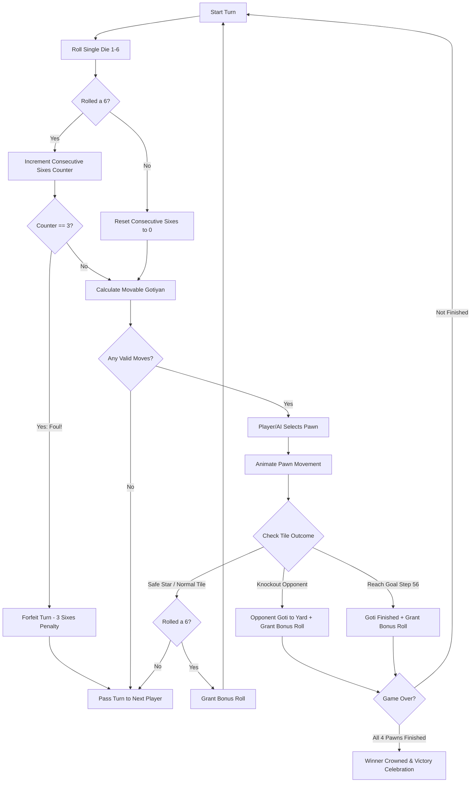

# 🎲 Classic 1-Die Ludo Gameplay & Mechanics Architecture

> **Mode:** Classic Ludo (1-Die Mode)  
> **Engine Implementation:** [`LudoGameEngine`](file:///d:/Ludo-own/public/js/game_engine.js) | [`public/js/game_engine.js`](file:///d:/Ludo-own/public/js/game_engine.js)  
> **Visual Presentation:** 3D WebGL / Three.js Heirloom Tabletop  

---

## 1. Overview & Board Architecture

In **Classic 1-Die Mode**, the game adheres to standard competitive international Ludo rules with a single 6-sided die ($1$ to $6$). Four players compete on a 3D board to navigate all four of their gotiyan (pawns) from their home yard, around a 52-tile perimeter track, and up their private home runway into the center Goal Triangle.

### Board Components
- **4 Corner Yards (Houses):**
  - **Red:** Top-Right quadrant (`cx: 4.68, cz: -4.68`)
  - **Yellow:** Bottom-Left quadrant (`cx: -4.68, cz: 4.68`)
  - **Blue:** Top-Left quadrant (`cx: -4.68, cz: -4.68`)
  - **Charcoal:** Bottom-Right quadrant (`cx: 4.68, cz: 4.68`)
- **52 Perimeter Track Tiles:** Shared circular circuit (Step 0 to Step 50 relative to player start).
- **8 Safe Star Tiles (Zero-Knockout Sanctuaries):**
  - 4 Player Release/Start Tiles: Indices `[0, 13, 26, 39]`
  - 4 Mid-Track Safe Star Tiles: Indices `[8, 21, 34, 47]`
- **4 Private Home Runways:** 5 colored tiles per player (Steps 51 to 55), immune to opponent attacks.
- **Center Home Triangle (Goal):** Step 56. Reaching this step marks the pawn as finished.

---

## 2. Step-by-Step Gameplay Loop

---

## 3. Core Rules & Logic Specifications

### 3.1. Releasing a Goti from the Yard
- All pawns start inside their recessed yard platforms at `stepOnTrack = -1`.
- A pawn **requires an exact roll of 6** to be released from the yard.
- Upon release, the pawn lands on **Step 0** (the player's designated runway opening / start tile).
- Releasing a pawn with a 6 also grants an **immediate bonus roll**.

### 3.2. Track Navigation & Step Indexing
- Track progression is strictly linear: `stepOnTrack = stepOnTrack + roll`.
- Each player's ring tile is calculated relative to their quadrant start index:
  $$\text{currentRingIndex} = (\text{START\_TILE}[\text{playerId}] + \text{stepOnTrack}) \pmod{52}$$
- Steps `0` through `50`: Perimeter ring tiles.
- Steps `51` through `55`: Private colored home runway tiles.
- Step `56`: Central goal tile.

### 3.3. Knockout Mechanics (Goti Katna)
- When a moving pawn lands on an un-safe perimeter tile occupied by an opponent's pawn:
  1. The opponent's pawn is **captured** and sent directly back to its yard socket (`stepOnTrack = -1`).
  2. The capturing player receives an **immediate bonus roll**.
  3. Capture audio cue and dynamic particle celebration trigger.
- **Safe Star Protection:**
  - If an opponent pawn is resting on any of the 8 designated Safe Star tiles (`[0, 8, 13, 21, 26, 34, 39, 47]`), it **cannot be captured**.
  - Multiple pawns sharing a safe star tile automatically cluster radially without physical mesh overlap.

### 3.4. Three Consecutive Sixes Penalty (Foul)
- Rolling three consecutive 6s in a single turn forfeits the third roll.
- All pawns remain in their current positions, the bonus roll is cancelled, and the turn automatically advances to the next player.

### 3.5. Home Runway & Exact-Finish Rule
- After completing step 50, a pawn enters its player-exclusive colored runway.
- **Exact Roll Requirement:** To reach the Home Goal (step 56), the roll must be exact:
  $$\text{stepOnTrack} + \text{roll} = 56$$
- If `stepOnTrack + roll > 56`, the pawn **cannot move** and overshoots are strictly disallowed.
- Reaching Step 56 marks `pawn.isFinished = true`, triggers goal fanfare, and awards a bonus roll.

---

## 4. AI Bot Decision Architecture

The built-in AI bot evaluates all valid pawn moves using heuristic priority scoring:

| Priority | Scenario | Heuristic Weight | Action Rationale |
| :--- | :--- | :---: | :--- |
| **1 (Highest)** | Reaching Goal (Step 56) | `+1000 pts` | Lock in finished goti and grant bonus roll |
| **2** | Knocking Out Opponent | `+500 pts` | Eliminate opponent progress and gain free turn |
| **3** | Safe Star Entry | `+150 pts` | Secure pawn in invincible sanctuary |
| **4** | Yard Release (Roll of 6) | `+300 pts` | Mobilize idle goti into active play |
| **5** | Escaping Threat Tile | `+120 pts` | Move away from vulnerable attack range |
| **6** | Advancing Leading Goti | `+50 pts` | Steadily progress closest pawn toward home |

---

## 5. Turn Flow & Win Condition
1. Turn order cycles clockwise: **Red (Player 0) $\rightarrow$ Yellow (Player 1) $\rightarrow$ Blue (Player 2) $\rightarrow$ Charcoal (Player 3)**.
2. The first player whose 4 gotiyan all reach `isFinished = true` wins the match.
3. Victory banner displays with fireworks VFX and game state locks.
